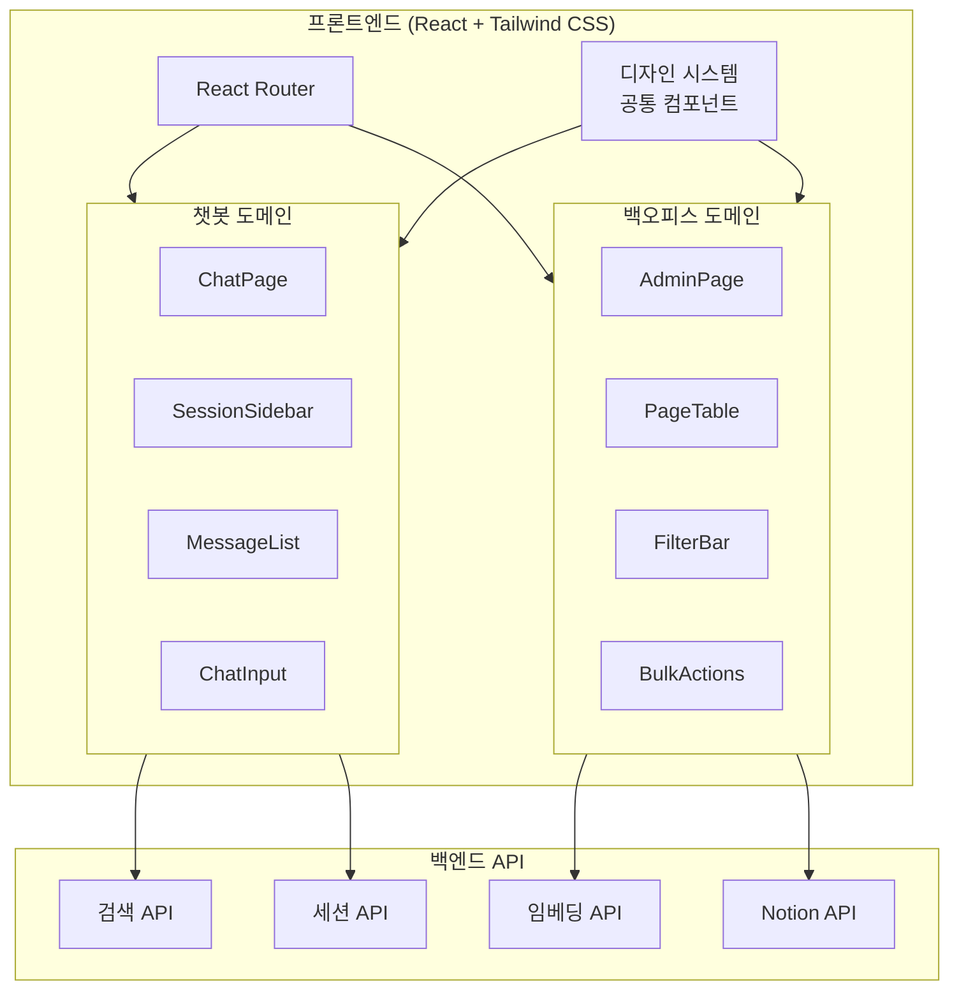

# 기술 설계 문서: Notion 검색 챗봇 + 임베딩 관리 백오피스

## 개요 (Overview)

Notion 검색 챗봇과 임베딩 관리 백오피스의 프론트엔드 설계 문서이다. React + Tailwind CSS 기반으로, 다크 테마의 미니멀하고 세련된 SaaS 스타일 UI를 구현한다.

시스템은 크게 두 영역으로 구성된다:
- **챗봇 인터페이스**: 사용자가 자연어로 Notion 콘텐츠를 검색하는 대화형 채팅 화면
- **백오피스**: 관리자가 Notion 페이지의 임베딩 상태를 조회·생성·관리하는 관리 화면

두 화면은 좌측 네비게이션 사이드바를 공유하며, 동일한 디자인 시스템 위에서 일관된 경험을 제공한다.

---

## 아키텍처 (Architecture)

### 전체 구조



### 프로젝트 디렉토리 구조

feature/domain 기반 구조를 채택한다. 공통 컴포넌트와 도메인별 코드를 명확히 분리한다.

```
src/
├── app/
│   ├── App.tsx                    # 루트 컴포넌트, 라우터 설정
│   └── routes.tsx                 # 라우트 정의
├── components/                    # 공통 디자인 시스템 컴포넌트
│   ├── Button.tsx
│   ├── Input.tsx
│   ├── Card.tsx
│   ├── Modal.tsx
│   ├── Sidebar.tsx
│   ├── Tabs.tsx
│   ├── Badge.tsx
│   ├── Checkbox.tsx
│   ├── Spinner.tsx
│   └── Layout.tsx                 # 공통 레이아웃 (사이드바 + 콘텐츠)
├── domains/
│   ├── chat/                      # 챗봇 도메인
│   │   ├── components/
│   │   │   ├── ChatPage.tsx
│   │   │   ├── SessionSidebar.tsx
│   │   │   ├── MessageList.tsx
│   │   │   ├── MessageBubble.tsx
│   │   │   ├── ChatInput.tsx
│   │   │   └── SourceLink.tsx
│   │   ├── hooks/
│   │   │   ├── useChat.ts
│   │   │   ├── useSessions.ts
│   │   │   └── useAutoScroll.ts
│   │   ├── types.ts
│   │   └── index.ts
│   └── admin/                     # 백오피스 도메인
│       ├── components/
│       │   ├── AdminPage.tsx
│       │   ├── FilterBar.tsx
│       │   ├── PageTable.tsx
│       │   ├── PageRow.tsx
│       │   ├── BulkActions.tsx
│       │   ├── EmbeddingStatusBadge.tsx
│       │   └── Pagination.tsx
│       ├── hooks/
│       │   ├── usePages.ts
│       │   ├── useEmbedding.ts
│       │   ├── useBulkSelection.ts
│       │   └── usePageFilter.ts
│       ├── types.ts
│       └── index.ts
├── hooks/                         # 공통 훅
│   └── useApi.ts
├── utils/                         # 공통 유틸리티
│   ├── api.ts                     # API 클라이언트
│   ├── cn.ts                      # clsx + twMerge 유틸
│   └── format.ts                  # 날짜/텍스트 포맷
├── types/                         # 공통 타입
│   └── index.ts
├── index.tsx
└── index.css                      # Tailwind 디렉티브 + 글로벌 스타일
```

### UI 컨셉

"Quiet Confidence" — 조용하지만 확신 있는 인터페이스.

핵심 원칙:
- **절제된 색상**: 거의 모노크롬에 가까운 다크 팔레트, 포인트 블루 1가지만 제한적 사용
- **넓은 호흡**: 충분한 여백으로 콘텐츠가 숨 쉴 공간 확보
- **텍스트 중심**: 아이콘보다 텍스트로 정보를 전달, 명확한 위계 구조
- **부드러운 경계**: 큰 border-radius와 은은한 보더로 요소 간 자연스러운 구분
- **평면적 깊이**: 그림자 대신 배경색 차이와 얇은 보더로 레이어 표현

---

## 컴포넌트 및 인터페이스 (Components and Interfaces)

### 1. 디자인 시스템 — 컬러 팔레트

| 용도 | 토큰명 | Hex 값 | 설명 |
|------|--------|--------|------|
| 메인 배경 | `bg-main` | `#0A0A0F` | 앱 전체 배경, 거의 검정 |
| 카드/패널 배경 | `bg-card` | `#141419` | 카드, 사이드바, 패널 배경 |
| 입력 필드 배경 | `bg-input` | `#1A1A22` | 인풋, 텍스트에어리어 배경 |
| 호버 배경 | `bg-hover` | `#1E1E28` | 리스트 아이템, 버튼 호버 |
| 기본 텍스트 | `text-primary` | `#E5E5EA` | 제목, 본문 텍스트 |
| 보조 텍스트 | `text-secondary` | `#6E6E80` | 부가 정보, 타임스탬프 |
| 비활성 텍스트 | `text-disabled` | `#3A3A4A` | 비활성 상태 텍스트 |
| 포인트 블루 | `accent` | `#4A7CFF` | CTA 버튼, 활성 탭, 링크 |
| 포인트 블루 호버 | `accent-hover` | `#3A6AEE` | 포인트 블루 호버 상태 |
| 보더 | `border` | `rgba(255,255,255,0.06)` | 카드, 패널 경계선 |
| 보더 포커스 | `border-focus` | `rgba(74,124,255,0.4)` | 포커스 상태 보더 |
| 성공 | `success` | `#34C759` | 완료 상태 뱃지 |
| 경고 | `warning` | `#FFB340` | 진행 중 상태 뱃지 |
| 오류 | `error` | `#FF453A` | 실패 상태, 에러 메시지 |

### 2. 디자인 시스템 — 타이포그래피

폰트 스택: `'Inter', -apple-system, BlinkMacSystemFont, 'Segoe UI', sans-serif`

| 레벨 | 크기 | 굵기 | 행간 | 용도 |
|------|------|------|------|------|
| Heading | 20px (text-xl) | 600 (semibold) | 1.4 | 페이지 제목, 섹션 헤더 |
| Body | 14px (text-sm) | 400 (normal) | 1.6 | 본문, 메시지, 테이블 셀 |
| Caption | 12px (text-xs) | 400 (normal) | 1.5 | 타임스탬프, 보조 정보, 뱃지 |

### 3. 디자인 시스템 — 레이아웃 원칙

- **기본 여백 단위**: 4px 배수 (Tailwind 기본 spacing 활용)
- **컴포넌트 간 간격**: 최소 16px (p-4, gap-4)
- **섹션 간 간격**: 24px~32px (p-6, gap-6~8)
- **콘텐츠 최대 너비**: 채팅 메시지 영역 768px, 백오피스 테이블 1200px
- **사이드바 너비**: 260px 고정
- **그리드**: CSS Grid / Flexbox 기반, 정렬감 있는 레이아웃
- **border-radius**: 카드/패널 16px (`rounded-2xl`), 버튼/인풋 12px (`rounded-xl`), 뱃지 8px (`rounded-lg`)

### 4. UI 컴포넌트 스타일 가이드

#### Button

3가지 변형: `primary`, `secondary`, `ghost`

```tsx
// 예시 컴포넌트 코드
interface ButtonProps extends React.ButtonHTMLAttributes<HTMLButtonElement> {
  variant?: 'primary' | 'secondary' | 'ghost';
  size?: 'sm' | 'md';
  children: React.ReactNode;
}

function Button({ variant = 'primary', size = 'md', children, className, ...props }: ButtonProps) {
  const base = 'inline-flex items-center justify-center font-medium transition-colors rounded-xl disabled:opacity-40 disabled:cursor-not-allowed';
  const sizes = {
    sm: 'px-3 py-1.5 text-xs',
    md: 'px-4 py-2 text-sm',
  };
  const variants = {
    primary: 'bg-accent text-white hover:bg-accent-hover',
    secondary: 'bg-transparent border border-border text-primary hover:bg-hover',
    ghost: 'bg-transparent text-secondary hover:text-primary hover:bg-hover',
  };
  return (
    <button className={cn(base, sizes[size], variants[variant], className)} {...props}>
      {children}
    </button>
  );
}
```

#### Input

```tsx
interface InputProps extends React.InputHTMLAttributes<HTMLInputElement> {
  label?: string;
}

function Input({ label, className, ...props }: InputProps) {
  return (
    <div className="flex flex-col gap-1.5">
      {label && <label className="text-xs text-secondary">{label}</label>}
      <input
        className={cn(
          'w-full bg-input border border-border rounded-xl px-4 py-2.5 text-sm text-primary',
          'placeholder:text-disabled outline-none',
          'focus:border-border-focus transition-colors',
          className
        )}
        {...props}
      />
    </div>
  );
}
```

#### Card

```tsx
interface CardProps {
  children: React.ReactNode;
  className?: string;
}

function Card({ children, className }: CardProps) {
  return (
    <div className={cn('bg-card border border-border rounded-2xl p-6', className)}>
      {children}
    </div>
  );
}
```

#### Sidebar

```tsx
function Sidebar({ children }: { children: React.ReactNode }) {
  return (
    <aside className="w-[260px] h-screen bg-card border-r border-border flex flex-col shrink-0">
      {children}
    </aside>
  );
}
```

#### Tabs

```tsx
interface TabsProps {
  tabs: { key: string; label: string }[];
  activeKey: string;
  onChange: (key: string) => void;
}

function Tabs({ tabs, activeKey, onChange }: TabsProps) {
  return (
    <div className="flex gap-1 border-b border-border">
      {tabs.map((tab) => (
        <button
          key={tab.key}
          onClick={() => onChange(tab.key)}
          className={cn(
            'px-4 py-2.5 text-sm transition-colors relative',
            activeKey === tab.key
              ? 'text-accent'
              : 'text-secondary hover:text-primary'
          )}
        >
          {tab.label}
          {activeKey === tab.key && (
            <span className="absolute bottom-0 left-0 right-0 h-0.5 bg-accent rounded-full" />
          )}
        </button>
      ))}
    </div>
  );
}
```

#### Modal

```tsx
interface ModalProps {
  open: boolean;
  onClose: () => void;
  title?: string;
  children: React.ReactNode;
}

function Modal({ open, onClose, title, children }: ModalProps) {
  if (!open) return null;
  return (
    <div className="fixed inset-0 z-50 flex items-center justify-center">
      <div className="absolute inset-0 bg-black/60" onClick={onClose} />
      <div className="relative bg-card border border-border rounded-2xl p-6 w-full max-w-md mx-4">
        {title && <h2 className="text-xl font-semibold text-primary mb-4">{title}</h2>}
        {children}
      </div>
    </div>
  );
}
```


### 5. 메인 화면 와이어프레임

#### 챗봇 화면

```
┌──────────────────────────────────────────────────────────────────┐
│ ┌──────────┐ ┌─────────────────────────────────────────────────┐ │
│ │ SIDEBAR  │ │                  CHAT AREA                      │ │
│ │ (260px)  │ │                                                 │ │
│ │          │ │  ┌─────────────────────────────────────────┐    │ │
│ │ [+ 새대화]│ │  │  사용자 메시지 버블 (우측 정렬)         │    │ │
│ │          │ │  └─────────────────────────────────────────┘    │ │
│ │ ──────── │ │                                                 │ │
│ │ 오늘     │ │  ┌─────────────────────────────────────────┐    │ │
│ │ ▸ 세션1  │ │  │  AI 응답 메시지 (좌측 정렬)             │    │ │
│ │ ▸ 세션2  │ │  │  ─────────────────────────────          │    │ │
│ │          │ │  │  📎 출처: Notion 페이지 링크             │    │ │
│ │ 어제     │ │  └─────────────────────────────────────────┘    │ │
│ │ ▸ 세션3  │ │                                                 │ │
│ │          │ │  ┌─────────────────────────────────────────┐    │ │
│ │          │ │  │  ● ● ● (로딩 인디케이터)                │    │ │
│ │          │ │  └─────────────────────────────────────────┘    │ │
│ │          │ │                                                 │ │
│ │          │ │ ┌───────────────────────────────────┐ ┌──────┐ │ │
│ │          │ │ │ 메시지를 입력하세요...             │ │ 전송 │ │ │
│ │          │ │ └───────────────────────────────────┘ └──────┘ │ │
│ └──────────┘ └─────────────────────────────────────────────────┘ │
└──────────────────────────────────────────────────────────────────┘
```

- 좌측 사이드바: 대화 세션 목록, 날짜별 그룹핑, 새 대화 버튼
- 우측 채팅 영역: 메시지 리스트 (스크롤), 하단 고정 입력창
- 사용자 메시지: 우측 정렬, 포인트 블루 배경
- AI 응답: 좌측 정렬, 카드 배경, 하단에 출처 링크
- 로딩: 타이핑 인디케이터 (점 3개 애니메이션)

#### 백오피스 화면

```
┌──────────────────────────────────────────────────────────────────┐
│ ┌──────────┐ ┌─────────────────────────────────────────────────┐ │
│ │ NAV      │ │  임베딩 관리                                    │ │
│ │ SIDEBAR  │ │                                                 │ │
│ │ (260px)  │ │  ┌─────────────────────────────────────────┐    │ │
│ │          │ │  │ [전체] [대기] [진행중] [완료] [실패]     │    │ │
│ │ 💬 챗봇  │ │  │ ┌──────────────────────┐ [일괄 임베딩]  │    │ │
│ │ 📦 임베딩│ │  │ │ 🔍 페이지 검색...    │                │    │ │
│ │          │ │  └─────────────────────────────────────────┘    │ │
│ │          │ │                                                 │ │
│ │          │ │  ┌─────────────────────────────────────────┐    │ │
│ │          │ │  │ ☐ │ 페이지 제목    │ 상태  │ 업데이트 │ 액션│ │
│ │          │ │  │───┼───────────────┼──────┼────────┼─────│    │ │
│ │          │ │  │ ☐ │ 프로젝트 개요  │ ✅완료│ 2h ago │ ... │    │ │
│ │          │ │  │ ☐ │ API 문서       │ ⏳진행│ 1m ago │ ... │    │ │
│ │          │ │  │ ☐ │ 회의록         │ ⬜대기│ --     │ 임베│    │ │
│ │          │ │  │ ☐ │ 디자인 가이드  │ ❌실패│ 5m ago │ 재시│    │ │
│ │          │ │  └─────────────────────────────────────────┘    │ │
│ │          │ │                                                 │ │
│ │          │ │  ◀ 1 2 3 ... 10 ▶                              │ │
│ └──────────┘ └─────────────────────────────────────────────────┘ │
└──────────────────────────────────────────────────────────────────┘
```

- 좌측 네비게이션: 챗봇/백오피스 전환
- 상단 필터 바: 상태별 탭 필터 + 텍스트 검색 + 일괄 임베딩 버튼
- 중앙 테이블: 체크박스, 페이지 제목, 임베딩 상태 뱃지, 업데이트 시간, 액션 버튼
- 하단 페이지네이션

### 6. Tailwind CSS 설정 방향

```typescript
// tailwind.config.ts
import type { Config } from 'tailwindcss';

const config: Config = {
  content: ['./src/**/*.{ts,tsx}'],
  theme: {
    extend: {
      colors: {
        main: '#0A0A0F',
        card: '#141419',
        input: '#1A1A22',
        hover: '#1E1E28',
        primary: '#E5E5EA',
        secondary: '#6E6E80',
        disabled: '#3A3A4A',
        accent: {
          DEFAULT: '#4A7CFF',
          hover: '#3A6AEE',
        },
        success: '#34C759',
        warning: '#FFB340',
        error: '#FF453A',
        border: {
          DEFAULT: 'rgba(255,255,255,0.06)',
          focus: 'rgba(74,124,255,0.4)',
        },
      },
      borderRadius: {
        xl: '12px',
        '2xl': '16px',
      },
      fontFamily: {
        sans: ['Inter', '-apple-system', 'BlinkMacSystemFont', 'Segoe UI', 'sans-serif'],
      },
      fontSize: {
        xs: ['12px', { lineHeight: '1.5' }],
        sm: ['14px', { lineHeight: '1.6' }],
        xl: ['20px', { lineHeight: '1.4' }],
      },
      width: {
        sidebar: '260px',
      },
      maxWidth: {
        chat: '768px',
        table: '1200px',
      },
    },
  },
  plugins: [],
};

export default config;
```

### 7. 주요 Tailwind 클래스 패턴

| 패턴 | 클래스 조합 | 용도 |
|------|------------|------|
| 카드 기본 | `bg-card border border-border rounded-2xl p-6` | 카드, 패널 |
| 인풋 기본 | `bg-input border border-border rounded-xl px-4 py-2.5 text-sm text-primary placeholder:text-disabled focus:border-border-focus outline-none transition-colors` | 텍스트 입력 |
| 버튼 Primary | `bg-accent text-white rounded-xl px-4 py-2 text-sm font-medium hover:bg-accent-hover transition-colors` | 주요 액션 |
| 버튼 Secondary | `bg-transparent border border-border text-primary rounded-xl px-4 py-2 text-sm font-medium hover:bg-hover transition-colors` | 보조 액션 |
| 버튼 Ghost | `bg-transparent text-secondary rounded-xl px-4 py-2 text-sm hover:text-primary hover:bg-hover transition-colors` | 최소 강조 |
| 뱃지 | `inline-flex items-center px-2.5 py-0.5 rounded-lg text-xs font-medium` | 상태 표시 |
| 사이드바 | `w-sidebar h-screen bg-card border-r border-border flex flex-col shrink-0` | 네비게이션 |
| 오버레이 | `fixed inset-0 bg-black/60 z-50` | 모달 배경 |

### 8. 예시 컴포넌트: 임베딩 상태 뱃지

```tsx
type EmbeddingStatus = 'pending' | 'processing' | 'completed' | 'failed';

const STATUS_CONFIG: Record<EmbeddingStatus, { label: string; className: string }> = {
  pending: { label: '대기', className: 'bg-secondary/10 text-secondary' },
  processing: { label: '진행 중', className: 'bg-warning/10 text-warning' },
  completed: { label: '완료', className: 'bg-success/10 text-success' },
  failed: { label: '실패', className: 'bg-error/10 text-error' },
};

function EmbeddingStatusBadge({ status }: { status: EmbeddingStatus }) {
  const config = STATUS_CONFIG[status];
  return (
    <span className={cn('inline-flex items-center px-2.5 py-0.5 rounded-lg text-xs font-medium', config.className)}>
      {config.label}
    </span>
  );
}
```

### 9. 예시 컴포넌트: 메시지 버블

```tsx
interface MessageBubbleProps {
  role: 'user' | 'assistant';
  content: string;
  sources?: { title: string; url: string }[];
  timestamp: string;
}

function MessageBubble({ role, content, sources, timestamp }: MessageBubbleProps) {
  const isUser = role === 'user';
  return (
    <div className={cn('flex', isUser ? 'justify-end' : 'justify-start')}>
      <div
        className={cn(
          'max-w-[75%] rounded-2xl px-4 py-3 text-sm',
          isUser
            ? 'bg-accent text-white'
            : 'bg-card border border-border text-primary'
        )}
      >
        <p className="whitespace-pre-wrap">{content}</p>
        {sources && sources.length > 0 && (
          <div className="mt-3 pt-3 border-t border-border space-y-1">
            {sources.map((source, i) => (
              <a
                key={i}
                href={source.url}
                target="_blank"
                rel="noopener noreferrer"
                className="block text-xs text-accent hover:underline"
              >
                📎 {source.title}
              </a>
            ))}
          </div>
        )}
        <span className="block mt-1.5 text-xs text-secondary/60">{timestamp}</span>
      </div>
    </div>
  );
}
```

---

## 데이터 모델 (Data Models)

### 챗봇 도메인

```typescript
// domains/chat/types.ts

interface Message {
  id: string;
  sessionId: string;
  role: 'user' | 'assistant';
  content: string;
  sources?: Source[];
  createdAt: string;          // ISO 8601
}

interface Source {
  title: string;
  url: string;
  pageId: string;
}

interface Session {
  id: string;
  title: string;              // 첫 메시지 기반 자동 생성
  createdAt: string;
  updatedAt: string;
}

interface ChatState {
  sessions: Session[];
  activeSessionId: string | null;
  messages: Message[];
  isLoading: boolean;
  error: string | null;
}
```

### 백오피스 도메인

```typescript
// domains/admin/types.ts

type EmbeddingStatus = 'pending' | 'processing' | 'completed' | 'failed';

interface NotionPage {
  id: string;
  title: string;
  embeddingStatus: EmbeddingStatus;
  updatedAt: string | null;   // ISO 8601, null이면 미처리
  notionUrl: string;
}

interface PageFilter {
  status: EmbeddingStatus | 'all';
  search: string;
}

interface AdminState {
  pages: NotionPage[];
  filter: PageFilter;
  selectedIds: Set<string>;
  pagination: {
    page: number;
    pageSize: number;
    total: number;
  };
  bulkProgress: {
    isRunning: boolean;
    completed: number;
    total: number;
  } | null;
}
```

### API 인터페이스

```typescript
// utils/api.ts

interface SearchRequest {
  sessionId: string;
  query: string;
}

interface SearchResponse {
  message: Message;
}

interface SessionListResponse {
  sessions: Session[];
}

interface PageListRequest {
  status?: EmbeddingStatus;
  search?: string;
  page: number;
  pageSize: number;
}

interface PageListResponse {
  pages: NotionPage[];
  total: number;
}

interface EmbeddingRequest {
  pageIds: string[];
}

interface EmbeddingStatusResponse {
  pageId: string;
  status: EmbeddingStatus;
}
```


---

## 정확성 속성 (Correctness Properties)

*속성(Property)이란 시스템의 모든 유효한 실행에서 참이어야 하는 특성 또는 동작이다. 속성은 사람이 읽을 수 있는 명세와 기계가 검증할 수 있는 정확성 보장 사이의 다리 역할을 한다.*

### Property 1: 질문 전송 후 응답 메시지 추가

*For any* 유효한 질문 문자열과 기존 메시지 리스트에 대해, 질문을 전송하고 API 응답을 받으면 메시지 리스트의 길이가 2 증가해야 한다 (사용자 메시지 + AI 응답 메시지).

**Validates: Requirements 1.1, 1.2**

### Property 2: 로딩 상태 인디케이터 표시

*For any* 채팅 상태에서, isLoading이 true이면 로딩 인디케이터가 렌더링되어야 하고, false이면 렌더링되지 않아야 한다.

**Validates: Requirements 1.3**

### Property 3: 메시지 시간순 정렬

*For any* 메시지 배열에 대해, 화면에 표시되는 메시지의 순서는 createdAt 기준 오름차순이어야 한다.

**Validates: Requirements 2.1**

### Property 4: 새 대화 생성 시 빈 메시지 리스트

*For any* 기존 채팅 상태에서, 새 대화를 생성하면 활성 세션의 메시지 리스트는 비어있어야 하고, 세션 목록의 길이는 1 증가해야 한다.

**Validates: Requirements 2.2**

### Property 5: 세션 목록 완전 표시

*For any* 세션 배열에 대해, 사이드바에 렌더링되는 세션 항목의 수는 세션 배열의 길이와 같아야 한다.

**Validates: Requirements 2.3**

### Property 6: 세션 전환 시 올바른 메시지 로드

*For any* 세션 ID에 대해, 해당 세션을 선택하면 표시되는 모든 메시지의 sessionId가 선택된 세션 ID와 일치해야 한다.

**Validates: Requirements 2.4**

### Property 7: 페이지 행 필수 정보 표시

*For any* NotionPage 객체에 대해, 렌더링된 테이블 행에는 페이지 제목, 임베딩 상태 뱃지, 최종 업데이트 일시, 액션 버튼이 모두 포함되어야 한다.

**Validates: Requirements 3.1, 3.3, 8.2**

### Property 8: 임베딩 요청 시 올바른 페이지 ID 전송

*For any* NotionPage에 대해, 임베딩 버튼을 클릭하면 해당 페이지의 ID가 API 요청 페이로드에 포함되어야 한다.

**Validates: Requirements 3.2**

### Property 9: 임베딩 상태 변경 시 UI 갱신

*For any* NotionPage와 임의의 EmbeddingStatus 값에 대해, 상태 업데이트를 받으면 해당 페이지의 뱃지가 새로운 상태를 반영해야 한다.

**Validates: Requirements 3.4, 3.5**

### Property 10: 상태 필터 적용

*For any* 페이지 배열과 임의의 EmbeddingStatus 필터에 대해, 필터 적용 후 표시되는 모든 페이지의 embeddingStatus는 선택된 필터 값과 일치해야 한다.

**Validates: Requirements 4.2**

### Property 11: 텍스트 검색 필터 적용

*For any* 페이지 배열과 임의의 검색 문자열에 대해, 검색 필터 적용 후 표시되는 모든 페이지의 title은 검색 문자열을 포함해야 한다 (대소문자 무시).

**Validates: Requirements 4.3**

### Property 12: 체크박스 선택 상태 관리

*For any* 페이지 배열에 대해, 개별 체크박스를 토글하면 해당 페이지 ID가 selectedIds에 추가/제거되어야 하고, 전체 선택 체크박스를 클릭하면 현재 표시된 모든 페이지의 ID가 selectedIds에 포함되어야 한다.

**Validates: Requirements 5.1, 5.3**

### Property 13: 일괄 임베딩 요청 시 선택된 모든 페이지 ID 전송

*For any* selectedIds 집합에 대해, 일괄 임베딩을 실행하면 API 요청의 pageIds 배열이 selectedIds와 동일한 요소를 포함해야 한다.

**Validates: Requirements 5.2**

### Property 14: 일괄 처리 진행률 계산

*For any* bulkProgress 상태(completed, total)에 대해, 표시되는 진행률 퍼센트는 `Math.round((completed / total) * 100)`과 일치해야 한다.

**Validates: Requirements 5.4**

### Property 15: 메시지 role에 따른 시각적 구분

*For any* Message에 대해, role이 'user'이면 우측 정렬 + 포인트 블루 배경 스타일이 적용되고, role이 'assistant'이면 좌측 정렬 + 카드 배경 스타일이 적용되어야 한다.

**Validates: Requirements 7.3**

### Property 16: 출처 링크 완전 표시

*For any* sources 배열을 가진 Message에 대해, 렌더링된 메시지 버블에는 sources 배열의 모든 항목에 대한 링크가 포함되어야 한다.

**Validates: Requirements 7.5**

### Property 17: 페이지네이션 계산

*For any* 양의 정수 total과 pageSize에 대해, 총 페이지 수는 `Math.ceil(total / pageSize)`와 일치해야 한다.

**Validates: Requirements 8.4**

---

## 에러 처리 (Error Handling)

### 챗봇 도메인

| 에러 상황 | 처리 방식 | UI 표현 |
|-----------|----------|---------|
| 검색 API 요청 실패 | error 상태 설정, isLoading false | 에러 메시지 + 재시도 버튼 표시 |
| 검색 결과 없음 | 빈 결과 응답 처리 | "관련 정보를 찾을 수 없습니다" 안내 메시지 |
| 세션 목록 로드 실패 | 빈 배열 폴백 | 사이드바에 에러 안내 + 재시도 |
| 네트워크 타임아웃 | AbortController 기반 타임아웃 (30초) | 타임아웃 에러 메시지 + 재시도 버튼 |

### 백오피스 도메인

| 에러 상황 | 처리 방식 | UI 표현 |
|-----------|----------|---------|
| 페이지 목록 로드 실패 | 빈 배열 폴백 | 테이블 영역에 에러 안내 + 재시도 |
| 개별 임베딩 실패 | 해당 페이지 상태를 'failed'로 갱신 | 실패 뱃지 + 재시도 버튼 |
| 일괄 임베딩 부분 실패 | 실패한 페이지만 'failed' 상태, 나머지 정상 처리 | 실패 건수 표시 + 실패 페이지 재시도 |
| Notion API 연동 오류 | 서버 에러 응답 처리 | 연동 상태 에러 안내 |

### 공통 에러 처리 패턴

```typescript
// hooks/useApi.ts
function useApi<T>(fetcher: () => Promise<T>) {
  const [data, setData] = useState<T | null>(null);
  const [isLoading, setIsLoading] = useState(false);
  const [error, setError] = useState<string | null>(null);

  const execute = useCallback(async () => {
    setIsLoading(true);
    setError(null);
    try {
      const result = await fetcher();
      setData(result);
    } catch (e) {
      setError(e instanceof Error ? e.message : '알 수 없는 오류가 발생했습니다.');
    } finally {
      setIsLoading(false);
    }
  }, [fetcher]);

  return { data, isLoading, error, execute };
}
```

---

## 테스트 전략 (Testing Strategy)

### 테스트 접근 방식

단위 테스트와 속성 기반 테스트를 병행하여 포괄적인 커버리지를 확보한다.

- **단위 테스트 (Unit Tests)**: 특정 예시, 엣지 케이스, 에러 조건 검증
- **속성 기반 테스트 (Property-Based Tests)**: 모든 입력에 대한 보편적 속성 검증

두 방식은 상호 보완적이다. 단위 테스트는 구체적인 버그를 잡고, 속성 기반 테스트는 일반적인 정확성을 검증한다.

### 테스트 도구

- **테스트 프레임워크**: Vitest
- **컴포넌트 테스트**: React Testing Library
- **속성 기반 테스트 라이브러리**: fast-check
- **최소 반복 횟수**: 속성 기반 테스트당 100회 이상

### 단위 테스트 범위

| 대상 | 테스트 내용 |
|------|------------|
| EmbeddingStatusBadge | 4가지 상태별 올바른 라벨과 스타일 렌더링 |
| MessageBubble | user/assistant role별 스타일, 출처 링크 렌더링 |
| Button | primary/secondary/ghost variant별 스타일 |
| Modal | open/close 상태, 오버레이 클릭 닫기 |
| FilterBar | 필터 탭 클릭 시 콜백 호출 |
| ChatInput | 빈 입력 전송 방지, Enter 키 전송 |
| 에러 상태 | API 실패 시 에러 메시지 + 재시도 버튼 표시 |
| 결과 없음 | 빈 검색 결과 시 안내 메시지 표시 |

### 속성 기반 테스트 범위

각 속성 기반 테스트는 설계 문서의 Property를 참조하는 태그 주석을 포함해야 한다.

태그 형식: `Feature: notion-search-chatbot, Property {번호}: {속성 설명}`

각 정확성 속성은 하나의 속성 기반 테스트로 구현되어야 한다.

| Property | 테스트 설명 | 생성기 |
|----------|------------|--------|
| 1 | 질문 전송 후 메시지 리스트 길이 증가 | 임의의 문자열 질문, 임의의 기존 메시지 배열 |
| 2 | isLoading 상태에 따른 인디케이터 렌더링 | 임의의 boolean |
| 3 | 메시지 시간순 정렬 검증 | 임의의 createdAt을 가진 Message 배열 |
| 4 | 새 대화 생성 후 빈 메시지 리스트 | 임의의 기존 Session 배열 |
| 5 | 세션 목록 완전 표시 | 임의의 Session 배열 |
| 6 | 세션 전환 시 올바른 sessionId 필터링 | 임의의 sessionId, 임의의 Message 배열 |
| 7 | 페이지 행 필수 정보 포함 | 임의의 NotionPage 객체 |
| 8 | 임베딩 요청 페이로드 검증 | 임의의 pageId |
| 9 | 상태 변경 후 뱃지 갱신 | 임의의 NotionPage, 임의의 EmbeddingStatus |
| 10 | 상태 필터 결과 검증 | 임의의 NotionPage 배열, 임의의 EmbeddingStatus |
| 11 | 텍스트 검색 결과 검증 | 임의의 NotionPage 배열, 임의의 검색 문자열 |
| 12 | 체크박스 선택 상태 검증 | 임의의 pageId 배열, 임의의 토글 대상 |
| 13 | 일괄 임베딩 페이로드 검증 | 임의의 selectedIds 집합 |
| 14 | 진행률 계산 검증 | 임의의 양의 정수 completed, total |
| 15 | 메시지 role별 스타일 검증 | 임의의 Message (user/assistant) |
| 16 | 출처 링크 완전 표시 검증 | 임의의 sources 배열을 가진 Message |
| 17 | 페이지네이션 계산 검증 | 임의의 양의 정수 total, pageSize |
